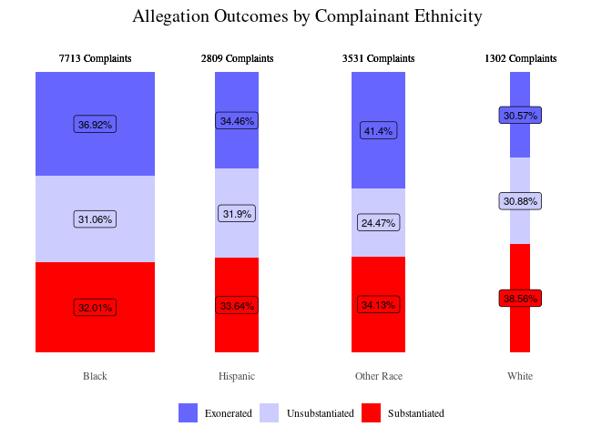
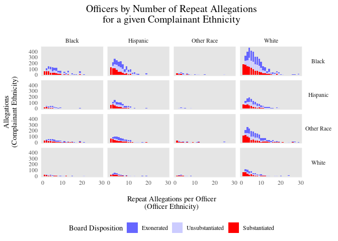
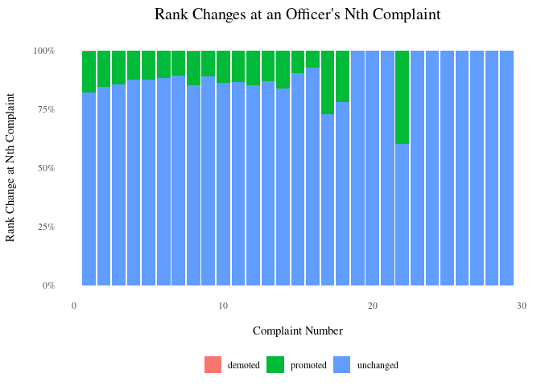

# Data Exploration

## Repeat Offenses

First, let's take a look at the distribution of repeat allegations.

In the left plot, we can see the total of number of officers with a given number of repeat allegations.  This plot demonstrates a declining pattern and indicates that 50% of officers in the database have fewer than 3 allegations against them.  Some officers have nearly 30 allegations against them.

In order to be included in the dataset, officers must have at least one substantiated allegation against them. In the plot on the right, which demonstrates the total number of allegations for all officers with a given number of repeat allegations, we can see that, indeed, for officers with only one allegation, it was substantiated.  This data inclusion condition skews the proportion of officers with fewer allegations toward substantiated.

```{r echo=F}
knitr::include_graphics("../src/visualizations/Visuals_files/figure-html/repeat_complaints-1.png")
```

But this dataset goes back until the 1980s and contains data only on current officers, and these data points concern officers who are still on the force and have had more time to collect allegations.  So, we can divide up the officers by "year of entry" (defined as the first registered year of a substantiated allegation) to compare officers who have had similar numbers of years to collect allegations.

```{r echo=F}
knitr::include_graphics("../src/visualizations/Visuals_files/figure-html/repeat_complaints_decade_entry-1.png")
```

## Repeat Offenses by Racial Demographics

The allegations against officers with a given number of repeat allegations vary by the race of the complainant and the race of the officer.  The below plot indicates that the majority of complainants are people of color, and a higher proportion of allegations of white complainants are substantiated.

```{r echo=F}

```

The below plot groups repeat allegations by the identified race of the complainant and the officer. This grouping demonstrates that the distribution of complaints is similar across racial demographics, and that the majority of allegations are Black complainants against White officers.

```{r echo=F}

```

## Rank Changes: associating the conclusion of the civilian complaint review board with changes in rank of officer.

<!--
I seek to identify potential disciplinary action in terms of rank changes over time associated with board disposition resolution..  Another way to look at presence of reactions to repeat offenses could be the change in command or precinct.
-->

First, let's take a look at the rates of substantiated claims over time.  It appears that, as time has passed, there have been an increase in number of substantiated and exonerated claims.  More than anything else, this likely reflects increasing investigation ability and improved data storage.  But, we can see that in the early 2000s, a higher proportion of allegations were exonerated than substantiated, and this differential has lessened in recent years.

```{r echo=F}
knitr::include_graphics("../src/visualizations/Visuals_files/figure-html/complaint_results_time-1.png")
```

<!--How is this impacted by admittance of officers into the dataset.-->

Potentially, officers who had lots of substantiated claims from a few decades ago have been fired, and so are no longer represented in this current dataset.
<!--
More and more new officers who have had only one substantiated complaint.
How to control for the missingness of the data.
We can't conclude anything from overall trends, but these bumps suggest that something interesting happened there.  Missingness of data doesn't explain the bumps (political climate).-->

Next, we might be able to see consequences for behavioral misconduct in terms of changes in rank.  We may see that certain conclusions of the civilian complaint review board on a given allegation are associated with an increase or decrease in rank of the officer.

In order to do this, I rated the ranks numerically as visible in the below table.  Also, I isolate a single result of grouped complaints based on the following hierarchy: substanitated, exonerated, unsubstantiated.

```{r echo=F, message=F, warning=F}
knitr::kable(readr::read_csv("../references/ranking_dictionary.csv"))
knitr::include_graphics("../src/visualizations/Visuals_files/figure-html/rank_changes_resolution-1.png")
```

Although we can see that most allegations go unsubstantiated, the proportions across these results are relatively equivalent.  Further, the clear majority of officer ranks remain unchanged after a given allegation, such that it is difficult to compare or identify patterns in promotion and demotion rates of officers.  <!--Actually, it seems that there is a pattern concerning promoted officers...-->


Next, we can look at the change of officer ranks over time.  First, we can look at the relationship between proportion of officers demoted as more allegations are levied against them.  There are hardly any demotions, and the potential increase in promotions may instead be associated with career length.

```{r echo=F}

```

However, it is important to remember that few officers make it to that many allegations. In the next plot, we the shading of the colors indicates the relative proportions of allegations for each x-axis unit.  This demonstrates again that the majority of officers don't a dozen or so allegations.

```{r echo=F}
knitr::include_graphics("../src/visualizations/Visuals_files/figure-html/rank_changes-2.png")
```

Now, we can take a look at the change in rank over time of those few officers with 15 or more complaints levied against them and have been demoted at least once throughout their careers.  We can see that many of them have had interesting, if not tumultuous careers.  Possibly, some of these recorded changes result from data entry errors, as I would not have expected there to be so many changes in the trajectory of ranks.  It could be that officers without allegations of misconduct have a more stable career trajectory, but we don't have data on that.  Demotions don't visually appear to be related to reaching a specific number of allegations, and are peppered throughout each of these officers' careers.  Also, of note, is that each of these officers end up at least as high in rank as they started.

```{r echo=F}
knitr::include_graphics("../src/visualizations/Visuals_files/figure-html/spark_plot_rank-1.png")
```

Other important variables to consider in the future include the time between lodged allegations and the conclusion type of the civilian complaint review board as the number of allegations increase.

<!--
The median response time to allegations is just over half a year.

Finally, we can take a look at where the allegations occur. (To be added...)-->
