# Data Exploration

## Overall Questions

1.  Which precinct has the most allegations?
2.  What are the characteristics of that precinct? (socioeconomically?)
3.  What is the average age of the complainant in which precincts?
4.  What is the average gender?
5.  What is the change in rank?
6.  Did the allegation happen in their command precinct?
7.  Have the number of complaints increased over time?
8.  Does it happen mostly with the same complainant?
9. Are certain allegations associated with higher substantiation rates?
10. How many allegations are frequently levied in the same complaint?

## What are the consequences of Allegations?

1.  How many are there?
2.  Does the amount change over time?
3.  Does it vary by the demographics of the complainaint ot the location of the complaint?
4.  What happens to officers as they continue to get allegations?

Another way to look at presence of reactions to repeat offenses could be the change in command or precinct.

### Repeat Offenses

First, let's take a look at the distribution of repeat allegations. In the below histogram, we can see that 50% of officers in this dataset have about 13 or fewer allegations (but that's a lot!). Also, some officers, have as many as 70 allegations against them!  But this dataset goes back until the 1980s and contains data only on current officers, and these data points concern officers who are still on the force and have had more time to collect allegations.  So, we can divide up the officers by "year of entry" (defined as the first registered year of a substantiated allegation) to compare officers who have had similar numbers of years to collect allegations.

In order to be included in the dataset, officers must have at least one substantiated allegation against them. We can see in the below plots that, indeed, for officers with only one allegation, it was substantiated. I would expect that as officers continue to recieve allegations, there would be an increasing rate of substantiation, however, it appears to peter off. These patterns do not appear to vary by the race of the complainant (coded as white or other), although it does appear that nonwhite complainants compose a majority in this dataset.

Skews proportion toward substantiated for officers with fewer allegations

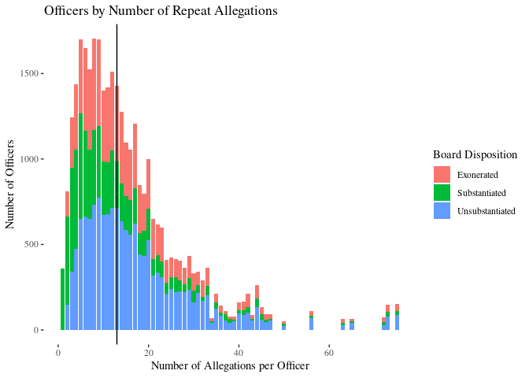<!-- -->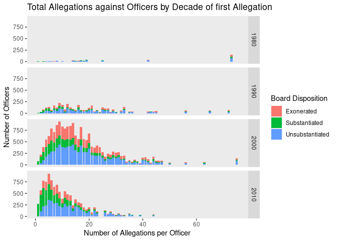<!-- -->

```
## Adding missing grouping variables: `unique_mos_id`
```

```
## # A tibble: 368 x 4
## # Groups:   unique_mos_id [5]
##    unique_mos_id last_name year_received incident
##            <dbl> <chr>             <dbl>    <int>
##  1         18530 Tallarine          1991        1
##  2         18530 Tallarine          1989        2
##  3         18530 Tallarine          1989        3
##  4         18530 Tallarine          1989        4
##  5         18530 Tallarine          1989        5
##  6         18530 Tallarine          1989        6
##  7         18530 Tallarine          1989        7
##  8         18530 Tallarine          1989        8
##  9         18530 Tallarine          1989        9
## 10         18530 Tallarine          1990       10
## # … with 358 more rows
```

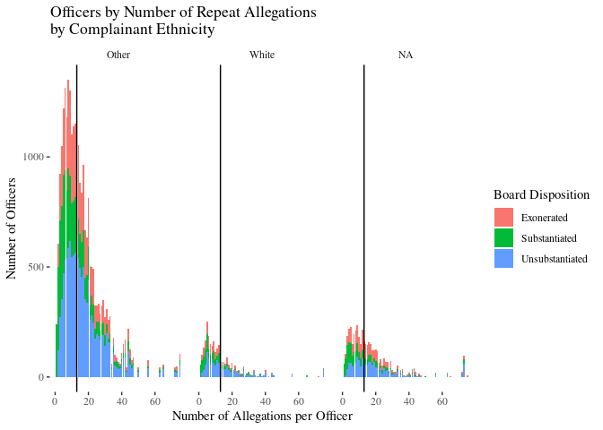<!-- -->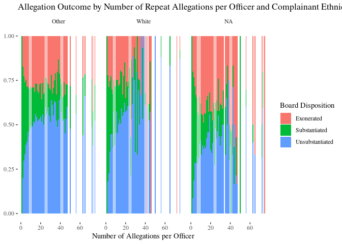<!-- -->

### Rank Changes: associating the conclusion of the civilian complaint review board with changes in rank of officer.

1. Do the proportions change the greater the number of allegations levied against an officer? (maybe a scatter plot?) x = incidents, y = proportion allegations associated with a demotion
2. How many allegations does it take for an officer to be demoted?
3. What is the change in rank over time?
4. How many officers have been demoted after a substantiated claim?
5. what is the breakdown in race of substantiated claims?
6. who are the people who are demoted and when along their career?  How many allegations does it take before a demotion?

First, let's take a look at the rates of substantiated claims over time.  It appears that, as time has passed, there have been an increase in number of substantiated and exonerated claims.  More than anything else, this likely reflects increasing investigation ability and improved data storage.  But, we can see that in the early 2000s, a higher proportion of allegations were exonerated than substantiated, and this differential has lessened in recent years.

How is this impacted by admittance of officers into the dataset.
Likely officers who had lots of substantiated claims from way back when have been fired (and so are no longer represented).
More and more new officers who have had only one substantiated complaint.
How to control for the missingness of the data.
We can't conclude anything from overall trends, but these bumps suggest that something interesting happened there.  Missingness of data doesn't explain the bumps (political climate).


```r
a %>% group_by(board_disposition = word(board_disposition, 1)) %>% filter(year_received < 2020) %>%
  ggplot(aes(x = year_received,
             fill = factor(board_disposition,
                           levels = c("Exonerated", "Unsubstantiated", "Substantiated")))) +
  geom_bar(position = "fill") + labs(fill = "Board Disposition")  +
  ggthemes::theme_tufte() +
  scale_fill_manual("", values = c("#6666FF", "#CCCCFF", "red")) +
  ggtitle("Proportion of Allegation Results Over Time") + xlab("Year Received") + ylab("Proportion")
```

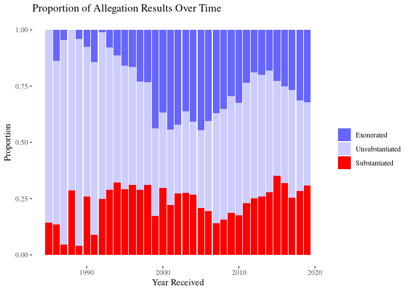<!-- -->

Next, we might be able to see consequences for behavioral misconduct in terms of changes in rank.  We may see that certain conclusions of the civilian complaint review board on a given allegation are associated with an increase or decrease in rank of the officer.

In order to do this, I rated the ranks numerically as visible in the below table.


```
## # A tibble: 8 x 2
##   rank_cat                rank
##   <chr>                  <int>
## 1 police officer             1
## 2 sergeant                   2
## 3 detective                  3
## 4 lieutenant                 4
## 5 captain                    5
## 6 deputy inspector           6
## 7 inspector                  7
## 8 chiefs and other ranks     8
```


Although we can see that most allegations go unsubstantiated, the proportions across these results are relatively equivalent.  Further, the clear majority of officer ranks remain unchanged after a given allegation, such that it is difficult to compare or identify patterns in promotion and demotion rates of officers.

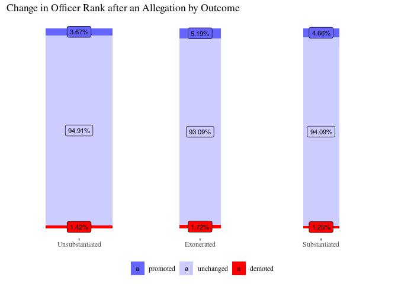<!-- -->


```r
a_dict %>%
  group_by(board_disposition = word(board_disposition, 1), complainant_ethnicity = case_when(
      complainant_ethnicity %in% c("White", "Black") ~ complainant_ethnicity,
      complainant_ethnicity %in% c("Unknown", "Refused") | is.na(complainant_ethnicity) ~ "Unknown",
      TRUE ~ "People of Color"
    )) %>% #summarize(count = n()) %>%
  ggplot(aes(x = board_disposition, group = result, fill = result)) + geom_bar(position = "fill") + facet_wrap(. ~ complainant_ethnicity) +
  theme(axis.text.x = element_text(angle = 60, vjust = 0.9, hjust = 1)) +
  ggtitle("race of complainant in allegations that result in a demotion")
```

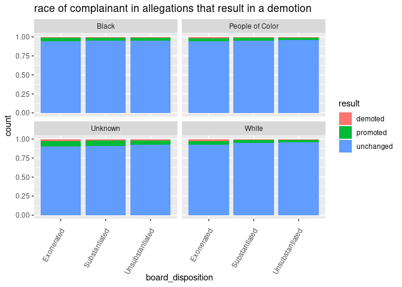<!-- -->

```r
# race of officer in allegations that result in a demotion
a_dict %>%
  group_by(board_disposition = word(board_disposition, 1), result = factor(result, levels = c("demoted", "unchanged", "promoted")), mos_ethnicity = case_when(
      mos_ethnicity %in% c("White", "Black") ~ mos_ethnicity,
      mos_ethnicity %in% c("Unknown", "Refused") | is.na(mos_ethnicity) ~ "Unknown",
      TRUE ~ "People of Color"
    )) %>% summarize(count = n()) %>% group_by(mos_ethnicity, board_disposition) %>% mutate(total = sum(count)) %>%
  # plot
  ggplot(aes(x = board_disposition, y = count,
             fill = result)) + geom_col(position = "fill") + facet_wrap(. ~ mos_ethnicity) +
  theme(axis.text.x = element_text(angle = 60, vjust = 0.9, hjust = 1)) +
   geom_label(aes(label = paste0(factor(round(count/total*100, digits = 2)),"%"), size = 2), position = position_fill(vjust = 0.5),
            size = 3)
```

```
## `summarise()` has grouped output by 'board_disposition', 'result'. You can override using the `.groups` argument.
```

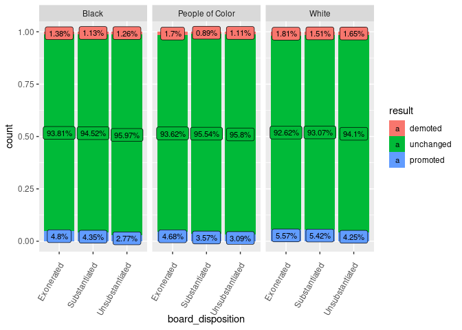<!-- -->

question: Important to mention duration here... (when is the case closed?)

Next, we can look at the change of officer ranks over time.  First, we can look at the relationship between proportion of officers demoted as more allegations are levied against them.  We can see in this first plot that, a higher percentage of allegations are associated with an officer's demotion after the 60th allegation.

However, it is important to remember that few officers make it to 60. In the next plot, we the shading of the colors indicates the relative proportions of allegations for each x-axis unit.  This demonstrates again that the majority of officers don't a dozen or so allegations.

Now, we can take a look at the change in rank over time of those officers with 60 or more allegations levied against them and have been demoted at least once throughout their careers.  We can see that many of them have had interesting, if not tumultuous careers.  I would not have expected there to be so many changes in the trajectory of ranks.  It could be that officers without allegations of misconduct have a more stable career trajectory, but we don't have data on that.  Demotions don't visually appear to be related to reaching a specific number of allegations, and are peppered throughout each of these officers' careers.  Also, of note, is that each of these officers end up at least as high in rank as they started.

Other important variables to consider in the future include the time between lodged allegations and the conclusion type of the civilian complaint review board as the number of allegations increase.

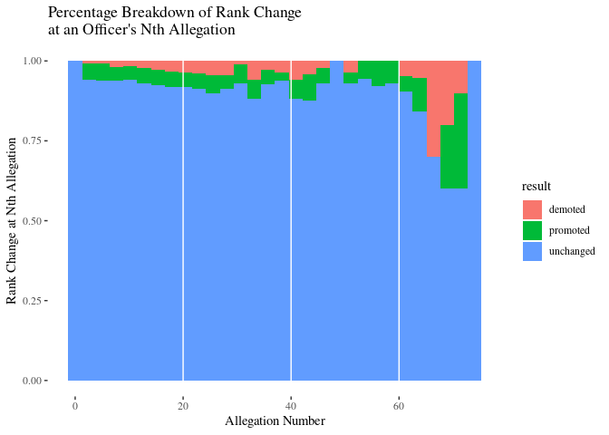<!-- -->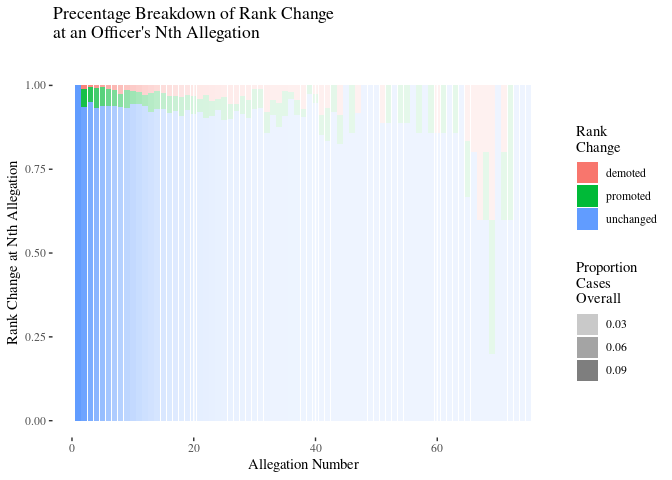<!-- -->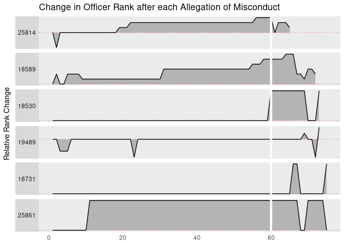<!-- -->

## Allegation Location

1. Where do allegations occur?
2. Do they occur in the same precinct that the office is assigned to?
3. Does it take longer to resolve allegations in some areas versus others?
4. duration between opening and closing

The median response time to allegations is just over half a year.

Finally, we can take a look at where the allegations occur.

### Most Frequent Allegation Location


```
## # A tibble: 79 x 3
##    precinct count total
##       <dbl> <int> <int>
##  1        1    68  8450
##  2        5    65  8450
##  3        6    53  8450
##  4        7    47  8450
##  5        9    68  8450
##  6       10    66  8450
##  7       13    46  8450
##  8       14    77  8450
##  9       17    19  8450
## 10       18   104  8450
## # … with 69 more rows
```

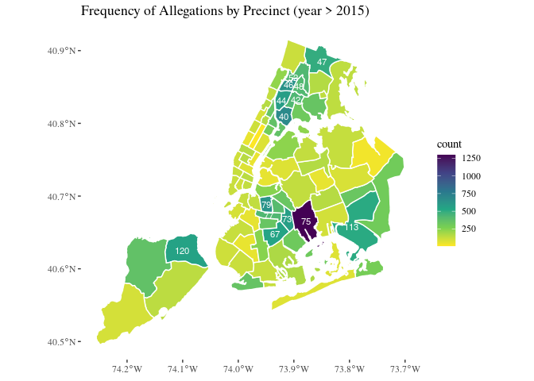<!-- -->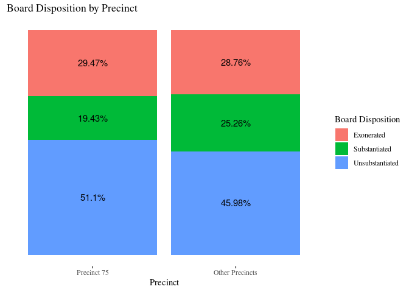<!-- -->

```
## # A tibble: 3 x 2
##   same  count
##   <lgl> <int>
## 1 FALSE  1188
## 2 TRUE  19627
## 3 NA      303
```

```
## # A tibble: 1 x 1
##   median
##    <dbl>
## 1  0.583
```

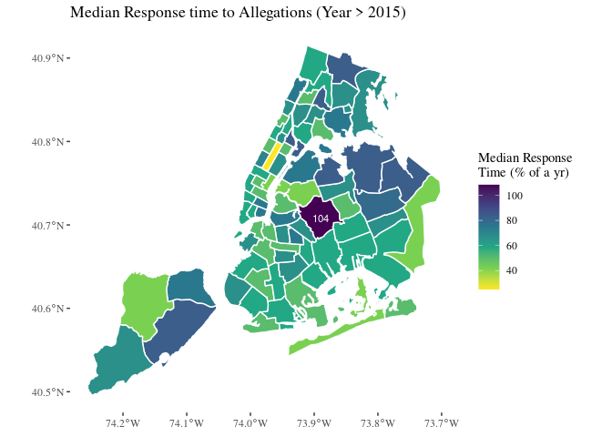<!-- -->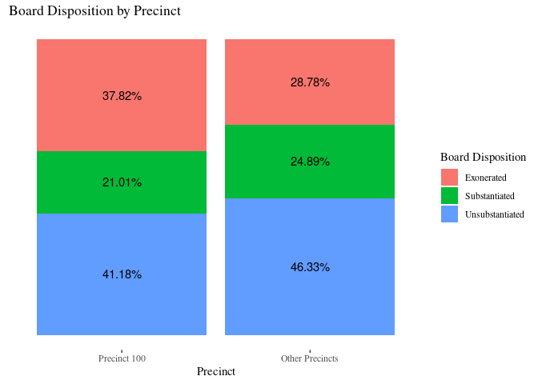<!-- -->
