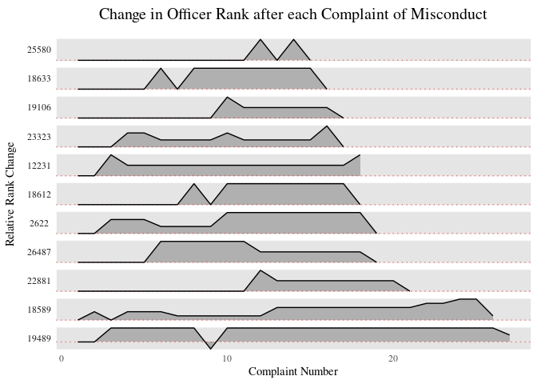

# Prep


```r
rm(list=ls())
knitr::opts_chunk$set(echo = TRUE)

library(tidyverse)
library(sf)
library(readxl)
```


```r
source("../features/rank_dict.R") # rank_dict
source("../features/rank_change.R") # a_dict
nypp <- st_read("../data/police_precincts", layer = "nypp")
```

```
## Reading layer `nypp' from data source `/home/arielle/sp21dspp/final_project/src/data/police_precincts' using driver `ESRI Shapefile'
## Simple feature collection with 77 features and 3 fields
## Geometry type: MULTIPOLYGON
## Dimension:     XY
## Bounding box:  xmin: 913175.1 ymin: 120121.9 xmax: 1067383 ymax: 272844.3
## Projected CRS: NAD83 / New York Long Island (ftUS)
```

```r
a <- read_csv("../data/allegations_202007271729.csv")
ny_pop <- read_csv("../data/nyc_2010pop_2020precincts.csv")
#ny_pop <- read_csv("data/nyc_2010pop_2020precincts.csv")
#ny_pop
```

# Repeat Complaints Overview

## Distribution of Repeat Complaints


```r
base <- a %>% group_by(unique_mos_id, complaint_id) %>% mutate(repeats = n()) %>%
  mutate(mos_eth = ifelse(mos_ethnicity == "White", "White", "Other"), complainant_eth = ifelse(complainant_ethnicity == "White", "White", "Other")) %>%
  ggplot(aes(x = repeats, group = word(board_disposition, 1), fill = word(board_disposition, 1))) +
  ggtitle("Officers by Number of Repeat Complaints") +
  xlab("Number of Allegations per Officer") +
  ggthemes::theme_tufte() +
  labs(fill = "Board Disposition") +
  scale_fill_manual("", values = c("#6666FF", "#CCCCFF", "red"))

base + geom_bar() + geom_vline(aes(xintercept = median(repeats))) + ylab("Number of Officers")
```

<!-- -->


```r
a_dict %>% mutate(decade_received = floor(year_received/10)*10) %>%
  group_by(unique_mos_id) %>% mutate(decade_first = min(decade_received)) %>%
  group_by(decade_first, unique_mos_id) %>% mutate(repeats = n()) %>%
  group_by(decade_first) %>% mutate(median = median(repeats)) %>%
  #filter(decade != 2020) %>%
  ggplot(aes(x = repeats, fill = word(board_disposition, 1))) + geom_bar() + facet_grid(decade_first ~ .) +
  ggtitle("Total Allegations against Officers by Decade of first Allegation") +
  theme(panel.grid = element_blank()) + labs(fill = "Board Disposition") + ylab("Number of Officers") + xlab("Number of Allegations per Officer")  +
  scale_fill_manual("", values = c("#6666FF", "#CCCCFF", "red")) +
  geom_vline(aes(xintercept = median))
```

<!-- -->

## Disribution of Repeat Complaints by Ethnicity


```r
# make race labels more visible
names <- c("Non-White", "White", "Unknown")

base + geom_bar() + geom_vline(aes(xintercept = median(repeats))) + ylab("Number of Officers") +
  facet_wrap(. ~ complainant_eth, aes(labeller = "label_value")) + ggtitle("Officers by Number of Repeat Allegations\nby Complainant Ethnicity")
```

<!-- -->

```r
# thin out axis labels
base + geom_bar(position = "fill") + ylab(NULL) +
  facet_wrap(. ~ complainant_eth) + ggtitle("Allegation Outcome by Number of Repeat Allegations per Officer and Complainant Ethnicity")
```

<!-- -->

# Rank Changes

## Complaint Result Over Time


```r
a_dict %>%
  group_by(board_disposition) %>%
  ggplot(aes(x = year_closed, fill = factor(board_disposition, levels = c("Exonerated", "Unsubstantiated", "Substantiated")))) + geom_bar(position = "fill") + labs(fill = "Board Disposition") +
  scale_fill_manual("", values = c("#6666FF", "#CCCCFF", "red"))  +
  ggtitle("Proportion of Complaints Results Over Time") + xlab("Year Closed") + ylab("Proportion") + ggthemes::theme_tufte()
```

<!-- -->

## Proportion of Rank Changes by Allegation Outcome


```r
breakdown <- a_dict %>% group_by(board_disposition) %>% summarize(count = n())
a_dict %>% #filter(incident == nth(incident, 3)) %>% don't know how to fitler for just the first one...
  group_by(board_disposition, result) %>%
  summarize(count = n()) %>%
  group_by(board_disposition) %>% mutate(total = sum(count)) %>% ungroup() %>% mutate(width = round(total/sum(count), digits = 4)) %>%
  ggplot(aes(x = reorder(board_disposition, -count), y = count,
             fill = result)) +
  geom_col(aes(width = width*1.2), position = "fill") +
  
  ggthemes::theme_tufte() +
  ggtitle("Proportion of Rank Changes after Complaint Resolution") + xlab(NULL) + ylab(NULL) +
  theme(legend.title = element_blank(), legend.position =  "bottom",
        axis.ticks.y = element_blank(), axis.text.y = element_blank()) +
  geom_label(aes(label = paste0(factor(round(count/total*100, digits = 2)),"%")), position = position_fill(vjust = 0.5),
            size = 3) +
  annotate("text", x = c("Unsubstantiated"), y = c(1.1), family="serif", size=3, 
           color="black", label = paste(min(breakdown$count), "allegations")) +
  annotate("text", x = c("Substantiated"), y = c(1.1), family="serif", size=3, 
           color="black", label = paste(median(breakdown$count), "allegations")) +
  annotate("text", x = c("Exonerated"), y = c(1.1), family="serif", size=3, 
           color="black", label = paste(max(breakdown$count), "allegations"))
```

<!-- -->

## Rank Changes Over Time (as complaint numbers increase)


```r
a_dict %>% group_by(complaint, result) %>% summarize(count = n()) %>%
  ggplot(aes(x = complaint, y = count, fill = result)) + geom_col(position = "fill") + 
  ggthemes::theme_tufte() + geom_vline(aes(xintercept = 25), color = "white") +
  #geom_vline(aes(xintercept = 40), color = "white") + geom_vline(aes(xintercept = 60), color = "white") +
  ggtitle("Rank Changes by at an Officer's Nth Complaint") + ylab("Rank Change at Nth Complaint") +
  xlab("Complaint Number")
```

<!-- -->

```r
a_dict %>% group_by(result, complaint) %>% summarize(count = n()) %>% group_by(complaint) %>% mutate(total = sum(count)) %>%
  ungroup() %>% mutate(alpha = total/sum(count)) %>% arrange(desc(complaint)) %>%
  ggplot(aes(x = complaint, y = count, fill = result, alpha = alpha)) + geom_col(position = "fill") +
  ggthemes::theme_tufte() + geom_vline(aes(xintercept = 20), color = "white") +
  ggtitle("Rank Changes by at an Officer's Nth Complaint") +
  xlab("Complaint Number") + ylab("Rank Change at Nth Complaint") +
  labs(fill = "Rank\nChange", alpha = "Proportion\nCases\nOverall")
```

<!-- -->


```r
# https://stackoverflow.com/questions/27135962/how-to-fill-geom-polygon-with-different-colors-above-and-below-y-0
a_dict %>% group_by(unique_mos_id) %>% filter(min(rank_change) < 0, max(complaint) >= 15) %>%
  #mutate(cat = x >= 0) %>%
  ggplot(aes(x = complaint, y = rank_diff_scale)) +
  geom_area(alpha = 0.3) + 
  #geom_col(aes(fill = col)) +
  geom_hline(aes(yintercept = 0), color = "red", alpha = 0.5, lty = "dotted") +
  geom_line() +
  facet_grid(reorder(unique_mos_id, complaint) ~ ., scales = "free_y", switch = "y") +
  #ggthemes::theme_tufte() +
  theme(axis.title.x=element_blank(), axis.text.y = element_blank(),
        strip.text.y.left = element_text(angle = 0),
        axis.ticks = element_blank(),
        panel.grid.major = element_blank(),
        panel.grid.minor = element_blank()) +
  ggtitle("Change in Officer Rank after each Complaint of Misconduct") +
  ylab("Relative Rank Change") + xlab("Allegation Number")
```

<!-- -->

# Geographic Visuals


```
## # A tibble: 79 x 3
##    precinct count total
##       <dbl> <int> <int>
##  1        1    68  8450
##  2        5    65  8450
##  3        6    53  8450
##  4        7    47  8450
##  5        9    68  8450
##  6       10    66  8450
##  7       13    46  8450
##  8       14    77  8450
##  9       17    19  8450
## 10       18   104  8450
## # … with 69 more rows
```

<!-- --><!-- -->

```
## # A tibble: 1 x 1
##   median
##    <dbl>
## 1  0.583
```

<!-- --><!-- -->


```r
a_dict %>%
  group_by(board_disposition = word(board_disposition, 1), complainant_ethnicity = case_when(
      complainant_ethnicity %in% c("White", "Black") ~ complainant_ethnicity,
      complainant_ethnicity %in% c("Unknown", "Refused") | is.na(complainant_ethnicity) ~ "Unknown",
      TRUE ~ "People of Color"
    )) %>% #summarize(count = n()) %>%
  ggplot(aes(x = board_disposition, group = result, fill = result)) + geom_bar(position = "fill") + facet_wrap(. ~ complainant_ethnicity) +
  theme(axis.text.x = element_text(angle = 60, vjust = 0.9, hjust = 1)) +
  ggtitle("race of complainant in allegations that result in a demotion")

# race of officer in allegations that result in a demotion
a_dict %>%
  group_by(board_disposition = word(board_disposition, 1), result = factor(result, levels = c("demoted", "unchanged", "promoted")), mos_ethnicity = case_when(
      mos_ethnicity %in% c("White", "Black") ~ mos_ethnicity,
      mos_ethnicity %in% c("Unknown", "Refused") | is.na(mos_ethnicity) ~ "Unknown",
      TRUE ~ "People of Color"
    )) %>% summarize(count = n()) %>% group_by(mos_ethnicity, board_disposition) %>% mutate(total = sum(count)) %>%
  # plot
  ggplot(aes(x = board_disposition, y = count,
             fill = result)) + geom_col(position = "fill") + facet_wrap(. ~ mos_ethnicity) +
  theme(axis.text.x = element_text(angle = 60, vjust = 0.9, hjust = 1)) +
   geom_label(aes(label = paste0(factor(round(count/total*100, digits = 2)),"%"), size = 2), position = position_fill(vjust = 0.5),
            size = 3)
```
