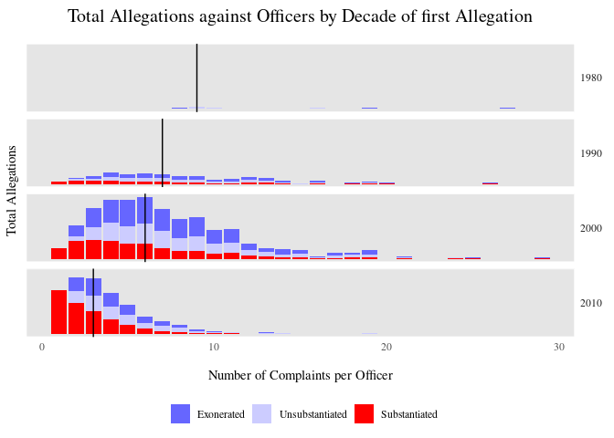
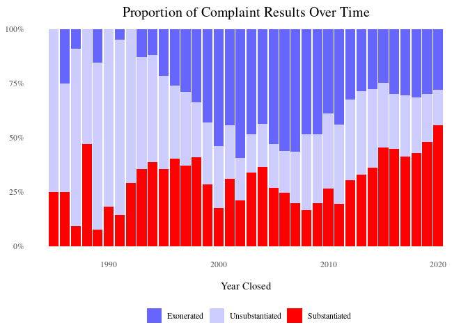
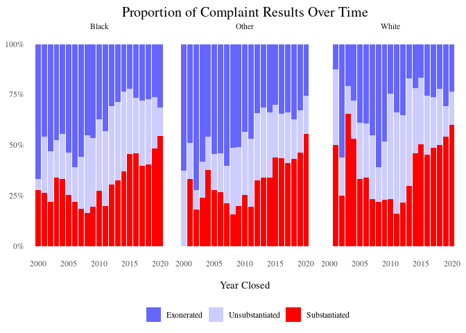
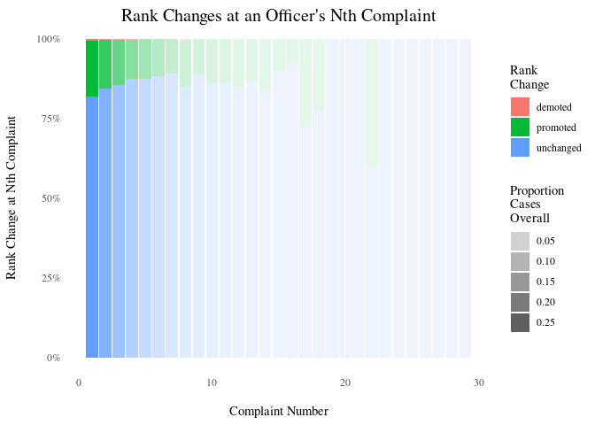

# Prep


```r
knitr::opts_chunk$set(echo = TRUE)
source("final_project_theme.R")

library(tidyverse)
library(sf)
library(readxl)
```


```r
source("../features/rank_dict.R") # rank_dict
source("../features/rank_change.R") # a_dict
nypp <- st_read("../data/police_precincts", layer = "nypp")
```

```
## Reading layer `nypp' from data source `/home/arielle/sp21dspp/final_project/src/data/police_precincts' using driver `ESRI Shapefile'
## Simple feature collection with 77 features and 3 fields
## Geometry type: MULTIPOLYGON
## Dimension:     XY
## Bounding box:  xmin: 913175.1 ymin: 120121.9 xmax: 1067383 ymax: 272844.3
## Projected CRS: NAD83 / New York Long Island (ftUS)
```

```r
a <- read_csv("../data/allegations_202007271729.csv")
ny_pop <- read_csv("../data/nyc_2010pop_2020precincts.csv")
#ny_pop <- read_csv("data/nyc_2010pop_2020precincts.csv")
#ny_pop
```

# Repeat Complaints Overview

## Distribution of Repeat Complaints
fix thi


```r
a_dict %>% filter(date_r > 2000) %>%
  group_by(Black = case_when(
    complainant_ethnicity == "Black" ~ "Black",
    complainant_ethnicity == "White" ~ "White",
    TRUE ~ "Other"),
    date_r) %>%
  summarize(count = n()) %>%
  group_by(date_r) %>%
  mutate(prop = count/sum(count)) %>%
  #filter(White == "White") %>%
  ggplot(aes(x = date_r, y = prop, group = Black, color = Black)) +
  ggthemes::theme_tufte() + geom_point(alpha = 0.5)  + geom_smooth() +
  scale_color_discrete(name = "Race", labels = c("White", "Black", "Unknown")) +
  ylab("Proportion of Complaintants") + ggtitle("Proportion of Complaints over Time")
```

```
## `summarise()` has grouped output by 'Black'. You can override using the `.groups` argument.
```

```
## `geom_smooth()` using method = 'loess' and formula 'y ~ x'
```

<!-- -->


```r
base <- a_dict %>% group_by(unique_mos_id) %>% mutate(repeats = n()) %>%
  mutate(mos_eth = ifelse(mos_ethnicity == "White", "White", "Other"), complainant_eth = ifelse(complainant_ethnicity == "Black", "Black", "Other")) %>%
  
  ggplot(aes(x = repeats, fill = factor(word(board_disposition, 1), levels = c("Exonerated", "Unsubstantiated", "Substantiated")))) +
  
  ggtitle("Officers by Number of Repeat Complaints") +
  xlab("\nNumber of Complaints per Officer") +
  labs(fill = "Board Disposition") +
  scale_fill_manual("", values = pal_disposition)

base + geom_bar() + geom_vline(aes(xintercept = median(repeats))) + ylab("Number of Officers\n")
```

<!-- -->


```r
a_dict %>% group_by(unique_mos_id) %>% summarize(count = n()) %>% arrange(desc(count))
```

```
## # A tibble: 3,996 x 2
##    unique_mos_id count
##            <dbl> <int>
##  1         18731    29
##  2         19489    27
##  3         18589    26
##  4         22775    25
##  5         25861    24
##  6         20982    21
##  7         22881    21
##  8         23903    20
##  9          2622    19
## 10         10039    19
## # … with 3,986 more rows
```

```r
a_dict %>% mutate(decade_received = floor(year_received/10)*10) %>%
  group_by(unique_mos_id) %>% mutate(decade_first = min(decade_received)) %>%
  group_by(decade_first, unique_mos_id) %>% mutate(repeats = n()) %>%
  group_by(decade_first) %>% mutate(median = median(repeats)) %>%
  #filter(decade != 2020) %>%
  ggplot(aes(x = repeats, fill = factor(word(board_disposition, 1),
                                        levels = c("Exonerated", "Unsubstantiated", "Substantiated")))) +
  geom_bar() + facet_grid(decade_first ~ .) + geom_vline(aes(xintercept = median)) +
  
  ggtitle("Total Allegations against Officers by Decade of first Allegation\n") +
  labs(fill = "Board Disposition") + ylab("Number of Officers") + xlab("\nNumber of Complaints per Officer")  +
  scale_fill_manual("", values = pal_disposition) +
  
  facet_theme
```

<!-- -->

## Disribution of Repeat Complaints by Ethnicity


```r
# make race labels more visible
names <- c("Non-White", "White", "Unknown")

base + geom_bar() + geom_vline(aes(xintercept = median(repeats))) + ylab("Number of Officers\n") +
  facet_wrap(. ~ complainant_eth, aes(labeller = "label_value")) + ggtitle("Officers by Number of Repeat Allegations\nby Complainant Ethnicity")
```

<!-- -->

```r
# thin out axis labels
base + geom_bar(position = "fill") + ylab(NULL) +
  facet_wrap(. ~ complainant_eth) + ggtitle("Allegation Outcome by Number of Repeat Allegations\nper Officer and Complainant Ethnicity") +
  scale_y_continuous(limits=c(0,1), labels = scales::percent)
```

<!-- -->

# Rank Changes

## Complaint Result Over Time


```r
a_dict %>%
  group_by(board_disposition) %>%
  ggplot(aes(x = year_closed, fill = factor(board_disposition, levels = c("Exonerated", "Unsubstantiated", "Substantiated")))) + geom_bar(position = "fill") + labs(fill = "Board Disposition") +
  scale_fill_manual("", values = pal_disposition) + scale_y_continuous(limits=c(0,1), labels = scales::percent) +
  ggtitle("Proportion of Complaint Results Over Time") + xlab("\nYear Closed") + ylab(NULL)
```

<!-- -->

```r
# note for future (change labels on facet_wrap)
a_dict %>% mutate(Black = case_when(
  complainant_ethnicity == "Black" ~ "Black",
  complainant_ethnicity == "White" ~ "White",
  TRUE ~ "Other")) %>%
  filter(date_r > 2000) %>%
  group_by(board_disposition) %>%
  ggplot(aes(x = year_closed, fill = factor(board_disposition, levels = c("Exonerated", "Unsubstantiated", "Substantiated")))) + geom_bar(position = "fill") + labs(fill = "Board Disposition") +
  scale_fill_manual("", values = pal_disposition)  + scale_y_continuous(limits=c(0,1), labels = scales::percent) +
  ggtitle("Proportion of Complaint Results Over Time") + xlab("\nYear Closed") + ylab(NULL) +
  facet_wrap(. ~ Black)
```

<!-- -->

## Proportion of Rank Changes by Allegation Outcome


```r
breakdown <- a_dict %>% group_by(board_disposition) %>% summarize(count = paste(n(), "Complaints"))
a_dict %>% #filter(incident == nth(incident, 3)) %>% don't know how to fitler for just the first one...
  group_by(board_disposition, result) %>% summarize(count = n()) %>%
  group_by(board_disposition) %>% mutate(total = sum(count)) %>%
  ungroup() %>% mutate(width = round(total/sum(count), digits = 4)) %>%
  
  ggplot(aes(x = reorder(board_disposition, -count), y = count,  fill = result)) +
  geom_col(aes(width = width*1.2), position = "fill") +
  
  ggtitle("Proportion of Rank Changes after Complaint Resolution") + xlab(NULL) + ylab(NULL) +
  scale_fill_discrete(NULL) +
  geom_label(aes(label = paste0(factor(round(count/total*100, digits = 2)),"%")),
             position = position_fill(vjust = 0.5), size = 3, show.legend = FALSE) +
  annotate("text", x = c(breakdown$board_disposition), y = rep(1.1, 3),
           family = "serif", size = 3, color = "black",
           label = breakdown$count) +
  
  theme(axis.text.y = element_blank())
```

<!-- -->

## Rank Changes Over Time (as complaint numbers increase)


```r
a_dict %>%
  group_by(complaint, result) %>% summarize(count = n()) %>%
  ggplot(aes(x = complaint, y = count, fill = result)) + geom_col(position = "fill") + 
  #geom_vline(aes(xintercept = 25), color = "white") +
  
  scale_y_continuous(labels = scales::percent) +
  
  ggtitle("Rank Changes at an Officer's Nth Complaint\n") +
  ylab("Rank Change at Nth Complaint\n") + xlab("\nComplaint Number") +
  labs(fill = "")
```

<!-- -->

```r
a_dict %>%
  group_by(result, complaint) %>% summarize(count = n()) %>% group_by(complaint) %>% mutate(total = sum(count)) %>%
  ungroup() %>% mutate(alpha = total/sum(count)) %>% arrange(desc(complaint)) %>%
  
  ggplot(aes(x = complaint, y = count, fill = result, alpha = alpha)) + geom_col(position = "fill") +
  geom_vline(aes(xintercept = 20), color = "white") +
  
  ggtitle("Rank Changes at an Officer's Nth Complaint") +
  xlab("\nComplaint Number") + ylab("Rank Change at Nth Complaint\n") +
  labs(fill = "Rank\nChange", alpha = "Proportion\nCases\nOverall") +
  scale_y_continuous(labels = scales::percent) +
  
  theme(legend.position = "right")
```

<!-- -->


```r
# https://stackoverflow.com/questions/27135962/how-to-fill-geom-polygon-with-different-colors-above-and-below-y-0
a_dict %>% group_by(unique_mos_id) %>% filter(min(rank_change) < 0, max(complaint) >= 15) %>%
  #mutate(cat = x >= 0) %>%
  ggplot(aes(x = complaint, y = rank_diff_scale)) +
  geom_area(alpha = 0.3) + 
  geom_hline(aes(yintercept = 0), color = "red", alpha = 0.5, lty = "dotted") +
  geom_line() +
  facet_grid(reorder(unique_mos_id, complaint) ~ ., scales = "free_y", switch = "y") +
  
  facet_theme +
  ggtitle("Change in Officer Rank after each Complaint of Misconduct\n") +
  ylab("Relative Rank Change") + xlab("Complaint Number")
```

<!-- -->

# Geographic Visuals


```r
# only look at the past five years to account for careers ending
# don't have a variable for when the incident occurred?
#sub <- a["year_received" > 2015, ]
#sub$month_received <- ifelse(length(sub$month_received == 1), paste0("0", sub$month_received), sub$month_received)
#sub$date <- as.yearmon(paste(sub$year_received, sub$month_received, sep = "-"))

# perhaps later look at the frequency of complaints?
summarize(group_by(filter(a, year_received > 2015), precinct), count = n()) %>% mutate(total = sum(count))
```

```
## # A tibble: 79 x 3
##    precinct count total
##       <dbl> <int> <int>
##  1        1    68  8450
##  2        5    65  8450
##  3        6    53  8450
##  4        7    47  8450
##  5        9    68  8450
##  6       10    66  8450
##  7       13    46  8450
##  8       14    77  8450
##  9       17    19  8450
## 10       18   104  8450
## # … with 69 more rows
```

```r
left_join(nypp, summarize(group_by(filter(a, year_received > 2010), precinct), count = n()),
          by = c("Precinct" = "precinct")) %>%
  left_join(ny_pop[c("precinct_2020", "P0010001")], by = c("Precinct" = "precinct_2020")) %>%
  ggplot() + geom_sf(aes(fill = count), color = "white") +
  #ggthemes::theme_tufte() +
  scale_fill_continuous(type = "viridis", direction = -1) +
  ggtitle("Frequency of Allegations by Precinct (year > 2015)") +
  geom_sf_text(aes(label = ifelse(count > 400, Precinct, "")), size = 3, color = "white") +
  theme(axis.title = element_blank())
```

<!-- -->

```r
# is there are higher substantiation or demotion rate per allegation in precinct 75?
a %>% group_by(precinct = precinct == 75, board_disposition = word(board_disposition, 1)) %>% summarize(count = n()) %>% na.omit() %>% group_by(precinct) %>% mutate(prop = round(count/sum(count), digits = 4)*100) %>%
  ggplot(aes(x = precinct, y = count, fill = board_disposition)) + geom_col(position = "fill") +
  #ggthemes::theme_tufte() +
  theme(axis.ticks.y = element_blank(), axis.text.y = element_blank()) +
  ggtitle("Board Disposition by Precinct") + labs(fill = NULL) + xlab(NULL) +
  scale_x_discrete(limits=c("TRUE", "FALSE"), labels = c("Precinct 75", "Other Precincts")) +
  geom_text(aes(label = paste0(prop, "%")), position = position_fill(vjust = 0.5)) + ylab(NULL)
```

<!-- -->

```r
# Median response time
a %>% filter(year_received > 2015) %>%
  mutate(date_r = zoo::as.yearmon(paste(year_received, month_received, sep = "-")),
         date_c = zoo::as.yearmon(paste(year_closed, month_closed, sep = "-")),
         # looks like a proportion of a year (ie .5 = 6 months)
         duration = (date_c - date_r)) %>% summarize(median = median(duration))
```

```
## # A tibble: 1 x 1
##   median
##    <dbl>
## 1  0.583
```

```r
a_reshape <- a %>% filter(year_received > 2015) %>%
  mutate(date_r = zoo::as.yearmon(paste(year_received, month_received, sep = "-")),
         date_c = zoo::as.yearmon(paste(year_closed, month_closed, sep = "-")),
         # looks like a proportion of a year (ie .5 = 6 months)
         duration = (date_c - date_r)) %>% group_by(precinct) %>% summarize(mean = median(duration)*100)

nypp %>% left_join(a_reshape, by = c("Precinct" = "precinct")) %>%
  ggplot() + geom_sf(aes(fill = mean), color = "white") +
  
  theme(axis.title = element_blank()) +
  scale_fill_continuous(type = "viridis", direction = -1) +
  ggtitle("Median Response time to Allegations (Year > 2015)") +
  labs(fill = "Median Response\nTime (% of a yr)") +
  geom_sf_text(aes(label = ifelse(mean >= 85, Precinct, "")), size = 3, color = "white")
```

<!-- -->

```r
a %>% group_by(precinct = precinct == 100, board_disposition = word(board_disposition, 1)) %>% summarize(count = n()) %>% na.omit() %>% group_by(precinct) %>% mutate(prop = round(count/sum(count), digits = 4)*100) %>%
  ggplot(aes(x = precinct, y = count, fill = board_disposition)) + geom_col(position = "fill") +
  #ggthemes::theme_tufte() +
  theme(axis.ticks.y = element_blank(), axis.text.y = element_blank()) +
  ggtitle("Board Disposition by Precinct") + labs(fill = NULL) + xlab(NULL) + ylab(NULL) +
  scale_x_discrete(limits=c("TRUE", "FALSE"), labels = c("Precinct 100", "Other Precincts")) +
  geom_text(aes(label = paste0(prop, "%")), position = position_fill(vjust = 0.5), family = "serif")
```

<!-- -->

```r
  #theme(axis.ticks.x = element_text(labels = c("100", "Other")))
```


```r
a_dict %>%
  group_by(board_disposition = word(board_disposition, 1), complainant_ethnicity = case_when(
      complainant_ethnicity %in% c("White", "Black") ~ complainant_ethnicity,
      complainant_ethnicity %in% c("Unknown", "Refused") | is.na(complainant_ethnicity) ~ "Unknown",
      TRUE ~ "People of Color"
    )) %>% #summarize(count = n()) %>%
  ggplot(aes(x = board_disposition, group = result, fill = result)) + geom_bar(position = "fill") + facet_wrap(. ~ complainant_ethnicity) +
  theme(axis.text.x = element_text(angle = 60, vjust = 0.9, hjust = 1)) +
  ggtitle("race of complainant in allegations that result in a demotion")

# race of officer in allegations that result in a demotion
a_dict %>%
  group_by(board_disposition = word(board_disposition, 1), result = factor(result, levels = c("demoted", "unchanged", "promoted")), mos_ethnicity = case_when(
      mos_ethnicity %in% c("White", "Black") ~ mos_ethnicity,
      mos_ethnicity %in% c("Unknown", "Refused") | is.na(mos_ethnicity) ~ "Unknown",
      TRUE ~ "People of Color"
    )) %>% summarize(count = n()) %>% group_by(mos_ethnicity, board_disposition) %>% mutate(total = sum(count)) %>%
  # plot
  ggplot(aes(x = board_disposition, y = count,
             fill = result)) + geom_col(position = "fill") + facet_wrap(. ~ mos_ethnicity) +
  theme(axis.text.x = element_text(angle = 60, vjust = 0.9, hjust = 1)) +
   geom_label(aes(label = paste0(factor(round(count/total*100, digits = 2)),"%"), size = 2), position = position_fill(vjust = 0.5),
            size = 3)
a
```
